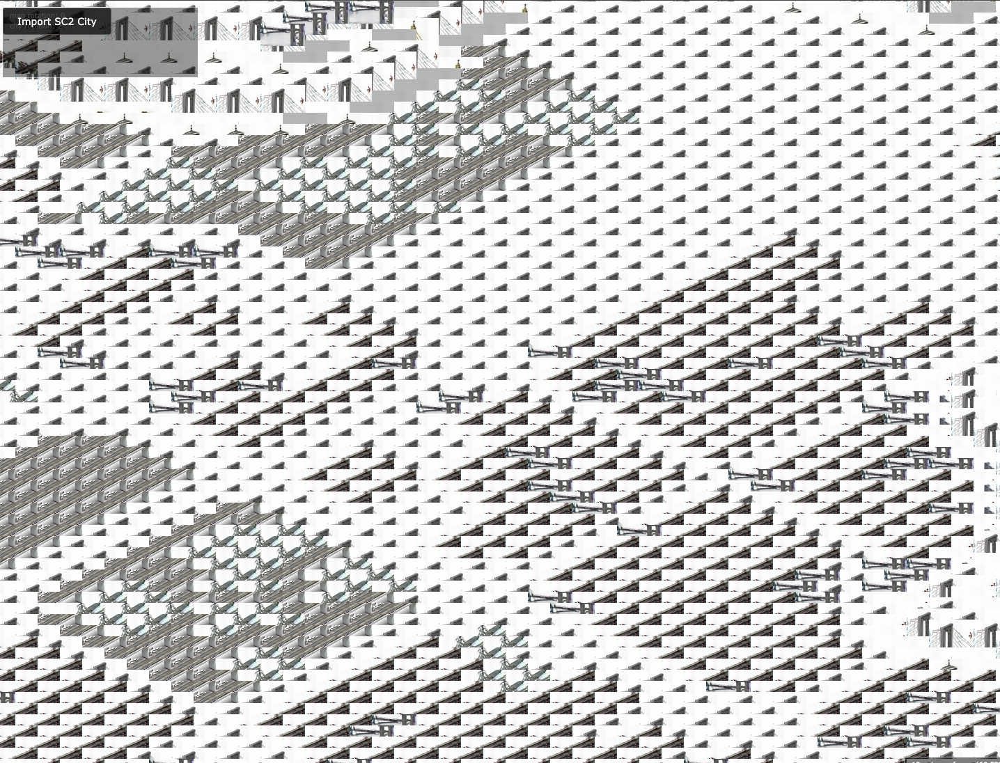

# Website Content Plan

## Overview

Personal developer portfolio showcasing full-stack expertise with a focus on AI technologies. The site combines technical depth with personal character through carefully crafted sections and spectacular visual effects.

---

## Base Design

**Inspiration:** Brittany Chiang's portfolio (brittanychiang.com)

**Core Identity:**
- Full Stack Developer
- AI Enthusiast (Agentic Coding, RAG, Skills/LLM Tooling)
- Human: Jogger, Pianist, Polyglot
- Contact: christian@haegele.dev

**Design Philosophy:**
Aesthetic: Sophisticated, high-performance dark-mode terminal aesthetic blended with elegant, flowing transitions that mimic a musical score or a running path. "Late-night coding session" energy that remains polished for recruiters and collaborators.

The design is playful, joyful. It uses modern web design and JavaScript/CSS tricks. Form follows function. UI elements are customized for the specific purpose, using icons, custom shapes etc.

---

## Site Structure

### 1. Navigation ("Polyglot" Navigation)
**Visual:** Minimalist glassmorphic navigation bar
**Behavior:**
- On hover, links cycle through names in different languages:
  - Home → Haus → Maison → Casa → Home
  - Work → Arbeit → Travail → Lavoro → Work
  - Hobbies → Hobbys → Loisirs → Hobby → Hobbies

**Effects:**
- Glassmorphic background
- Smooth language transition animation
- Glow effect on active/hover state

---

### 2. Hero Section ("Performance Metrics" Hero)
**Visual:** Terminal-style typed greeting with sinusoidal wave background animation (dark theme)
**Content:**
- Name: Christian Hägele
- Title: Full Stack Developer & AI Explorer
- Subtitle: Building intelligent systems, one agent at a time
- CTA: "Explore my work" / "Get in touch"

**Live Stats (optional):**
- **Commits this year:** `[LIVE]` via GitHub API (fetches contribution count)
- **Currently Learning:** Ticker that cycles through "Go", "Agentic Coding"

**Effects:**
- Terminal-style typing animation for greeting
- Sinusoidal wave background (mimics sound wave/heartbeat), see #pulse-background.md
- Text fades in with staggered delay
- Glassmorphic overlay elements
- Smooth scroll indicator at bottom
- Live commit counter animates on load (counts up from 0)
- Learning ticker has subtle marquee/cycle animation

See #landing-view.md for more details.

---

### 3. About Section
**Visual:** Split layout - content left, visual right
**Content:**

#### Who I Am
> I'm a full-stack developer passionate about the intersection of code and intelligence. My journey spans from traditional web development to the cutting edge of AI—where I now spend most of my time building agents, implementing LLM tools, and creating skill frameworks for LLMs.

#### Beyond the Screen
When I'm not tweaking LLM integrations or debugging agents, you'll find me:
- **Jogging** - Early morning runs to clear my mind
- **Playing Piano** - Classical to balance the logic
- **Learning Languages** - Currently exploring Chinese (always learning)

#### Philosophy
> Technology should feel magical. The best experiences combine technical excellence with human wonder.

**Effects:**
- Scroll-triggered fade-in
- Highlighted text effect on key phrases ("AI", "agents", "magical")
- Subtle parallax on background elements

---

### 4. Expertise / Skills Section
**Visual:** Interactive grid or cards with hover effects
**Content:**

#### AI & Machine Learning
- **Agentic Coding** - multi-agent orchestration, tool use
- **RAG Systems** - Retrieval-augmented generation, vector databases, embeddings
- **Skills Framework** - LLM tool integration, function calling, skill libraries
- **LLM Engineering** - Prompt engineering, fine-tuning, model evaluation

#### Full Stack Development
- **Frontend** - React, TypeScript
- **Backend** - Java, Go, API design, microservices
- **Databases** - MSSQL, vector stores (DuckDB), graph stores
- **DevOps** - Docker, CI/CD (Azure Pipelines), cloud platforms (Azure)

#### Tools & Technologies
- OpenAI API, GraphQL
- Vector databases, embeddings (OpenAI, HuggingFace)
- Java, TypeScript, Go
- React

**Effects:**
- Magnetic hover effect on skill cards
- Icons animate on hover (subtle rotation/scale)
- Staggered reveal on scroll
- Highlighted text for category headers

---

### 4.1 Tools I Actually Use
**Visual:** Minimalist list with icons, styled like a `.config` file or CLI output
**Content:**

> The real stack. Not the "impress recruiters" stack.

**Editor:** VS Code + opencode (AI-powered CLI coding agent)
**Terminal:** Terminal.app
**Browser:** Zen (Firefox-based, privacy-first)
**Notes:** VS Code (markdown files, obviously)

**Effects:**
- Monospace font for that dotfile aesthetic
- Icons glow on hover
- Subtle typing animation effect (like `cat .toolsrc`)

---

### 5. Projects Section ("Continuous Integration" Portfolio)
**Visual:** Git log-style project cards with commit icons and hover reveal
**Content:**

#### Featured Projects

**Project 1: Agentic Tasks**
A persistent task management system designed for AI agents
**Tech:** JavaScript, TypeScript, Shell
**Links:** [GitHub](https://github.com/karma-works/agentic-tasks)

**Project 2: Papercraft Web**
A web-based tool to unwrap 3D models into printable papercraft patterns. Client/server application with Rust backend and React frontend.
**Tech:** Rust, TypeScript, HTML
**Links:** [GitHub](https://github.com/karma-works/papercraft-web)

**Project 3: Claudine Skills**
Permissively-licensed reimplementations of proprietary Anthropic Claude skills
**Tech:** Python
**Links:** [GitHub](https://github.com/karma-works/claudine-skills)

#### Web Experiments
- CSS Animation Showcase (this website!)
- Interactive visualizations

**Effects:**
- Git log-style layout with commit icons showing technologies
- Cards have 3D tilt effect on hover
- Image reveal with clip-path animation
- Staggered grid animation on scroll
- Project titles use highlight effect on hover
- Glassmorphic card backgrounds

---

### 5.1 Graveyard of Ideas
**Visual:** Dimmed, monochrome cards with faded aesthetic - the "abandoned projects" vibe
**Content:**

> Not every idea makes it. Here's where the ambitious ones rest—projects that taught me more in failure than success ever could.

**Project: SC2K City Viewer**
An ambitious attempt to create a fully open-source SimCity 2000 city viewer by replacing proprietary game assets with AI-generated tilemaps. The goal: a legal, functional city viewer requiring no original game files.
**What Went Wrong:** AI struggled to generate a consistent sprite set—the buildings didn't look like they belonged in the same city. Computer vision extracted descriptions, but the generative step couldn't maintain visual coherence across 400+ assets.
**What I Learned:** AI image generation excels at one-off creations but fails at systematic asset libraries requiring stylistic consistency. Sometimes the human touch isn't replaceable.
**Tech:** TypeScript, Python, Vite
**Screenshot:** 
**Links:** [GitHub](https://github.com/karma-works/sc2k-city-viewer)

**Effects:**
- Desaturated/faded card backgrounds (ghost-like)
- Subtle "dust" particle effect on hover
- Grayscale until hover, then hint of color returns
- Elegiac typography (smaller, more muted)

---

### 6. Hobbies Section (The "Trifecta")
**Visual:** Three-column glassmorphic cards with interactive widgets
**Content:**

#### Running
- Latest Strava stats (distance, pace, weekly total)
- Minimalist heat map of favorite routes
- Personal records with subtle animations

#### Piano
- Mini interactive keyboard (also in footer)
- Current repertoire or learning pieces
- Musical journey timeline

#### Languages
- "Language Level" grid with progress bars styled like code loading sequences
- Languages: German (native), English (fluent), French (fluent), Spanish (fluent), Chinese (exploring)
- Visual progress indicators

**Effects:**
- Glassmorphic card backgrounds
- Running: Animated stats counters, route map hover effects
- Piano: Clickable keys with sound, theme color shifts
- Languages: Progress bars animate on scroll into view

---

### 6.1 Desk Setup
**Visual:** Illustrated/isometric desk diagram or photo with labeled callouts
**Content:**

> Where the magic happens. And by magic, I mean bugs.

**Hardware:**
- **Monitor:** 38" ultrawide (immersive coding, no window switching)
- **Desk:** Standing desk (best code is written standing... occasionally)
- **Keyboard:** Apple wired keyboard (tactile, reliable, no charging anxiety)
- **Mouse:** Logitech MX Master (ergonomic, programmable buttons)

**Effects:**
- Hover on hardware items highlights them in the illustration
- Subtle parallax on desk elements
- Standing desk: optional "sitting/standing" toggle animation

---

### 7. Writing / Blog Section (Optional/Minimal)
**Visual:** Clean list with hover states
**Content:**

#### Articles
1. **"Building Effective AI Agents: Lessons Learned"**
   Practical insights from building production agent systems

2. **"RAG Beyond the Basics"**
   Advanced retrieval strategies and evaluation metrics

3. **"The Art of CSS Animation"**
   How we built the flower effect (meta!)

**Effects:**
- List items slide in from left on scroll
- Hover: slight indent + highlight color
- Reading time indicator with subtle animation

---

### 8. Contact Section
**Visual:** Clean, centered with floating elements
**Content:**

#### Let's Build Something Together
> Whether you want to discuss AI architecture, collaborate on a project, or just chat about piano and running routes—I'd love to hear from you.

**Primary Contact:**
- Email: christian@haegele.dev
- GitHub: https://github.com/karma-works/
- LinkedIn: https://www.linkedin.com/in/christian-haegele-3403aaa/

**Quick Form (optional):**
- Name
- Email
- Message
- Submit with satisfying interaction

**Effects:**
- Floating flower petals (subtle, 3-4 elements)
- Input fields have magnetic cursor attraction
- Submit button with liquid hover effect
- Success state with particle burst

---

### 9. Footer
**Content:**
- © 2025 Christian Hägele
- Built with TypeScript, React & CSS magic
- "Made with ♥ and lots of coffee"
- Interactive SVG piano keyboard

**Effects:**
- Minimal - just fade in
- Links have underline animation on hover
- Interactive piano keyboard: plays soft note on click, triggers UI theme changes (e.g., C-major shifts accent to yellow)

---

## Visual Theme & Effects Summary

### Color Palette

**Primary:**
- Background: #0d1117 (Deep Charcoal/Near Black)
- Accent: #00f5d4 (Electric Mint/Cyan)
- Secondary: #00bbff (Cyber Blue)
- Highlight: #f72585 (Neon Pink), #fee440 (Cyber Yellow), #72efdd (Soft Teal)

**Text:**
- Primary: #f0f6fc (Off-white/High Contrast)
- Secondary: #8b949e (Cool Gray)
- Muted: #484f58 (Deep Slate)

### Typography

- **Headings:** Inter or System UI, bold weights
- **Body:** Inter, regular weight
- **Accents/Quotes:** Caveat or La Belle Aurore - human, handwritten touch for language learning notes or running logs

### UI Effects

- **Glassmorphism:** Frosted glass effects for cards - maintain depth against black background
- **Glow Effects:** On buttons to make cyan accent pop
- **Transitions:** Elegant, flowing animations mimicking musical scores

**Don'ts**
- Never use rainbow effect in fonts!

### Effects Map

| Section | Primary Effect | Secondary Effects |
|---------|---------------|-------------------|
| Navigation | Polyglot hover cycle | Glass effect, glow |
| Hero | Terminal typed greeting + sinusoidal wave + live stats | Floating lights, text fade, commit counter, learning ticker |
| About | Scroll reveal | Highlighted text |
| Skills | Magnetic hover | Glassmorphic cards |
| Tools I Use | Dotfile/CLI aesthetic | Icon glow, typing effect |
| Projects | Git log style + 3D card tilt | Clip-path reveal |
| Graveyard | Ghostly desaturated cards | Dust particles, grayscale-to-hint |
| Hobbies | Interactive Trifecta widgets | Strava stats, piano, language progress |
| Desk Setup | Illustrated diagram with callouts | Parallax, hover highlights |
| Contact | Floating petals | Magnetic inputs |
| Footer | Interactive piano keyboard | Theme color shifts on key press |
| Global | Smooth scroll | Glassmorphism, glow effects |

---

## Technical Implementation Notes

### Performance Priorities
1. Lazy load below-fold sections
2. Use `will-change` sparingly
3. Prefer CSS animations over JS where possible
4. Optimize images (WebP format)
5. Use Intersection Observer for scroll triggers

### Accessibility
1. Respect `prefers-reduced-motion`
2. Maintain color contrast (WCAG AA minimum)
3. Keyboard navigation support
4. Screen reader friendly structure
5. Focus states on all interactive elements

### Responsive Design Principles

The entire site must be responsive with graceful degradation across all viewport sizes:

#### Responsive Breakpoints

| Breakpoint | Width | Adaptations |
|------------|-------|-------------|
| Desktop Large | > 1440px | Full effects, maximum key count |
| Desktop | 1024px - 1440px | Full effects, 25 piano keys |
| Tablet | 768px - 1024px | Partial effects, reduced keys |
| Mobile | 375px - 768px | Simplified animations, minimal keys |
| Very Small | < 375px | Essential features only, C2 start |

#### Responsive Piano Behavior

The piano keyboard adapts gracefully to screen size by **reducing octaves and keys**, not just shrinking:

| Breakpoint | Keys | Range | Octaves | Notes |
|------------|------|-------|---------|-------|
| Desktop (>1024px) | 25 keys | C2-C4 | 2 octaves | Full chromatic (normal piano range) |
| Tablet (768-1024px) | 17 keys | C2-C3 | 1 octave | Full chromatic |
| Mobile (480-768px) | 8 keys | C3-C4 | 1 octave | White keys only, C3 start for mobile UX |
| Very Small (<480px) | 8 keys | C3-C4 | 1 octave | White keys only, C3 start for mobile UX |

**Key Rules:**
- **Desktop/Tablet**: Start from C2 (normal piano keyboard range)
- **Mobile only**: Start from C3 for better mobile UX
- Reduce octave count before shrinking key width
- Maintain playable key dimensions (minimum 30px width on mobile)
- Black keys may be hidden on very small screens for touch targets

#### Responsive Pulse Wave

The pulse background maintains **proportional visual appearance** across all screen sizes:

| Property | Scaling Formula | Ratio Maintained |
|----------|-----------------|------------------|
| Amplitude | `clamp(8px, 3vh, 40px)` | ~1:8 with wavelength |
| Wavelength | `clamp(80px, 25vw, 300px)` | ~3:4 with viewport |
| Stroke Width | `clamp(1px, 0.15vw, 3px)` | ~1:20 with amplitude |
| Glow Radius | `clamp(5px, 1vw, 20px)` | ~1:2 with amplitude |

**Critical Rule:** Amplitude and wavelength MUST scale together. Never shrink only the wavelength while keeping amplitude constant—this creates a distorted, visually unbalanced wave.

#### Responsive Section Adaptations

| Section | Mobile Adaptation |
|---------|-------------------|
| Navigation | Hamburger menu, no polyglot cycling |
| Hero | Simplified stats, smaller terminal |
| About | Single column, reduced parallax |
| Skills | Single column grid, simpler hover effects |
| Projects | Single column, reduced 3D effects |
| Hobbies | Stacked cards, simpler widgets |
| Contact | Simplified form, fewer floating elements |
| Footer | Compact layout, reduced piano keys |

#### Touch Considerations

- All interactive elements minimum 44px touch target
- Disable hover-dependent effects on touch devices
- Use `pointer: coarse` media query for touch-specific styles
- Swipe gestures for carousel/slider navigation

---

## Content Writing Guidelines

### Tone
- Professional but approachable
- Technical without being jargon-heavy
- Enthusiastic about AI, grounded in reality
- Personal touches (hobbies) show human side

### Language
- English (primary)
- German (optional toggle for local context)
- Code examples in English

### Key Messages
1. **AI-First:** Not just using AI, building AI systems
2. **Full-Stack:** End-to-end capability
3. **Continuous Learning:** Always exploring (tech & life)
4. **Craft:** Care about details, visual polish, user experience

---

## SEO & Meta

**Title:** Christian Hägele | Full Stack Developer & AI Engineer

**Description:** Full-stack developer specializing in AI agents, RAG systems, and intelligent applications. Building the future of software, one agent at a time.

**Keywords:** Full Stack Developer, AI Engineer, Agentic Coding, RAG, LLM, TypeScript, Python, React

---

## Future Content Ideas

### Phase 2
- Case studies for each project
- Technical blog with regular posts
- Newsletter signup
- Speaking engagements / conferences
- Open source contribution tracker

### Phase 3
- Interactive AI demos (in-browser)
- Project showcase with live examples
- Testimonials / client work
- Podcast / interview appearances
